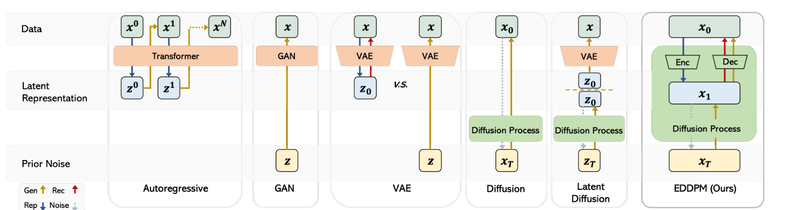
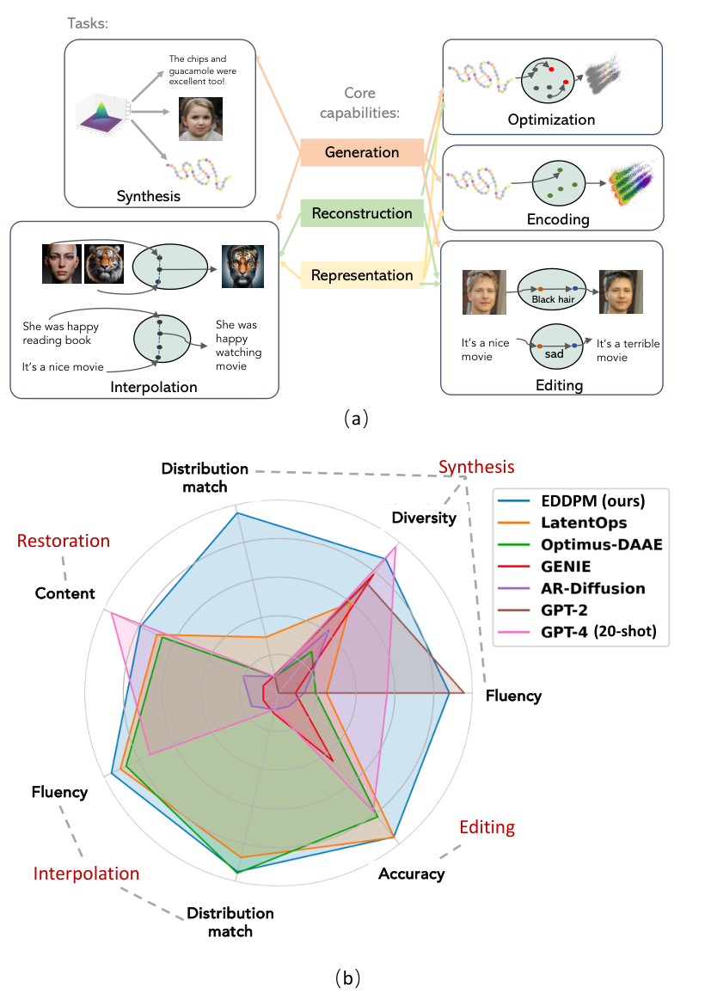

<div align="center">

# EDDPM

### Generalized Encoding-Decoding Diffusion Probabilistic Models

**Make the encoder and decoder *steps of the diffusion process itself* — the first noising step is a learned encoder, the last denoising step is a learned decoder — and one diffusion objective then trains generation, reconstruction and representation jointly, for text, proteins and images.**

[](https://proceedings.mlr.press/v235/liu24bh.html)
[](https://arxiv.org/abs/2402.19009)
[](LICENSE)
[](https://huggingface.co/datasets/guangyil/yelp_short)

[Guangyi Liu](https://guangyliu.github.io)<sup>&#42;1</sup>, Yu Wang<sup>&#42;2</sup>, Zeyu Feng<sup>&#42;2</sup>, Qiyu Wu<sup>3</sup>, Liping Tang<sup>1</sup>, Yuan Gao<sup>4</sup>, Zhen Li<sup>5</sup>, Shuguang Cui<sup>5</sup>, Julian McAuley<sup>2</sup>, Zichao Yang<sup>6</sup>, Eric P. Xing<sup>1,6</sup>, Zhiting Hu<sup>2</sup>

<sup>1</sup>MBZUAI · <sup>2</sup>UC San Diego · <sup>3</sup>University of Tokyo · <sup>4</sup>Stanford · <sup>5</sup>CUHK-Shenzhen · <sup>6</sup>CMU &nbsp; <sub>&#42; equal contribution</sub>

*Published at ICML 2024 as* **Unified Generation, Reconstruction, and Representation: Generalized Diffusion with Adaptive Latent Encoding-Decoding**



</div>

---

## The idea in one paragraph

A standard diffusion model is a chain `x₀ → x₁ → … → x_T` where every forward step adds
Gaussian noise and every reverse step removes it. Nothing in the DDPM variational bound
requires the *first* step to be Gaussian noise. EDDPM replaces it with a **learned encoder**
`q_λ(x₁ | x₀) = N(E_λ(x₀), β₀ I)` that maps the input into a low-dimensional latent, and
replaces the *last* reverse step with a **learned decoder** `p_φ(x₀ | x₁)` of whatever form
the data needs — a GPT-2 that emits tokens, a convolutional head for protein sequences, a
UNet for pixels. Everything in between is ordinary diffusion in latent space.

Because the encoder/decoder are literally the terminal steps of the chain, they are trained
with the **same ELBO and the same recipe as DDPM** — the usual `L₀ + Σ L_{t-1} + L_T`
decomposition, with `L₀` now the decoder's reconstruction term. No adversarial loss, no KL
annealing / free bits / cyclic schedules that text VAEs need, and no separately pretrained
autoencoder frozen before the diffusion model is trained (as in latent diffusion). One
model therefore does three jobs at once:

| Capability | What you get | Why it works |
|---|---|---|
| **Generation** | sample `x_T`, denoise to `x₁`, decode | latent diffusion prior, fluent decoder |
| **Reconstruction** | encode → decode, `x₁` is deterministic-ish | `L₀` is an explicit reconstruction term |
| **Representation** | `x₁` is a semantic vector: interpolate, add/subtract attribute directions, regress properties | the diffusion terms regularise the latent *dynamically*, avoiding VAE posterior collapse and the generation/reconstruction trade-off |

Discrete data is handled by choosing a discrete decoder (e.g. a pretrained LM), so EDDPM
sidesteps the token-space diffusion that makes text diffusion models struggle, and it can
plug in large pretrained LMs as encoder/decoder directly.

**Keywords:** encoding-decoding diffusion · learnable forward process · encoder and decoder as
diffusion steps · latent diffusion · unified generation / reconstruction / representation ·
diffusion autoencoder · text diffusion with pretrained LMs · protein sequence design ·
image synthesis, interpolation and manipulation · VAE posterior collapse.

<div align="center"></div>

---

## Results

### Text (Yelp reviews, BERT-small encoder / GPT-2-xl decoder)

| | Reconstruction BLEU ↑ | Generation PPL ↓ | Generation MAUVE ↑ | Diversity ↑ | Latent-arithmetic editing Acc ↑ | Interpolation PPL ↓ | Interpolation MAUVE ↑ |
|---|---|---|---|---|---|---|---|
| LatentOps | 87.6 | 68.1 | 0.240 | 0.50 | 57.3 | 32.5 | 0.697 |
| Optimus-DAAE | 86.1 | 94.1 | 0.006 | 0.17 | 51.0 | 33.7 | 0.770 |
| GENIE (token-space diffusion) | 58.5 | 337.6 | 0.013 | 0.69 | 33.9 | 258.2 | 0.029 |
| AR-Diffusion (token-space diffusion) | 64.1 | 157.8 | 0.007 | 0.32 | 17.0 | 163.9 | 0.012 |
| GPT-2 (fine-tuned) | – | 15.0 | 0.015 | 0.65 | – | – | – |
| GPT-4 (20-shot) | 100 | 25.7 | 0.007 | 0.87 | 49.3 | 39.7 | 0.010 |
| **EDDPM** | **92.1** | 16.4 | **0.977** | 0.79 | 57.1 | **30.8** | 0.763 |

Training cost is essentially that of a text VAE with the same backbone (19.4 vs 14.0 min/epoch,
7.4 vs 7.0 h total vs. LatentOps) and the loss curve is monotone — no annealing schedule to tune.

### Images (FID ↓, T = 50 sampling steps; UNet encoder, DiffAE-style decoder)

| Dataset | Model | Generation | Reconstruction (rFID) | Interpolation α=0.2 | Interpolation α=0.4 |
|---|---|---|---|---|---|
| FFHQ 128 | DDIM | 15.08 | 22.23 | 75.81 | 105.31 |
| | DiffAE | 12.57 | 5.93 | 9.38 | 22.17 |
| | **EDDPM** | **12.26** | **5.48** | **6.66** | **16.98** |
| CelebA 64 | DDIM | 8.52 | 16.76 | 51.84 | 82.77 |
| | DiffAE | 7.05 | 5.87 | 6.90 | 15.35 |
| | **EDDPM** | **6.65** | **5.15** | **6.23** | **14.85** |
| LSUN Bedroom 128 | DDIM | 7.14 | 11.81 | 76.28 | 139.81 |
| | DiffAE | 6.50 | 4.13 | 6.00 | 12.01 |
| | **EDDPM** | **6.35** | **3.49** | **5.39** | **10.58** |

Full tables with T = 10 / 20, LDM, NVAE, StyleGAN-XL, consistency models, horse, and
attribute-manipulation AUCs are in the paper (Tables 7–8).

### Proteins (Gifford and GFP fitness datasets, ReLSO setting)

Transformer encoder + convolutional decoder with a jointly trained fitness regressor on the
latent. EDDPM's latent gives the best fitness regression on all four metrics (MSE, L1,
Pearson, Spearman) on Gifford against ReLSO, NOS (discrete/Gaussian diffusion) and a VAE,
and yields higher-fitness sequences under latent-space optimisation (§4.3, §C.3).

---

## Repository

```
Text/      BERT-small encoder + GPT-2 decoder on Yelp / Amazon reviews  (§4.1)
Image/     UNet encoder/decoder on FFHQ, CelebA, LSUN bedroom / horse    (§4.2)
Protein/   transformer/conv autoencoder + fitness regressor, ReLSO data  (§4.3)
asset/     figures
```

Each folder is self-contained with its own environment and README:
[`Text/README.md`](Text/README.md), [`Image/README.md`](Image/README.md),
[`Protein/README.md`](Protein/README.md).

### Text quick start

```bash
cd Text
conda create -n eddpm python==3.9.1 pytorch==1.11.0 torchvision==0.12.0 cudatoolkit=11.3 -c pytorch
conda activate eddpm && bash build_envs.sh
bash download_datasets.sh          # pre-fetches guangyil/yelp_short and guangyil/amazon_tokenized from the HF Hub
cd code && bash train_joint_split_data_DDP_yelp.sh   # 4-GPU DDP joint training (set DATA / num_gpu at the top)
```

The tokenised Yelp (446,811 / 448) and Amazon (551,455 / 1,000) review corpora are hosted on
the Hugging Face Hub as [`guangyil/yelp_short`](https://huggingface.co/datasets/guangyil/yelp_short)
and [`guangyil/amazon_tokenized`](https://huggingface.co/datasets/guangyil/amazon_tokenized)
(fields `bert_token`, `gpt2_token`); the training script loads them with `datasets.load_dataset`.
Raw text versions and the sentiment labels used for the editing evaluation can be rebuilt with
[`LatentOps/data/prepare_data.py`](https://github.com/guangyliu/LatentOps/blob/main/data/prepare_data.py).

### Image quick start

```bash
cd Image
python run_ffhq128_joint.py       # or run_celeba64_joint.py / run_bedroom128_joint.py / run_horse128_joint.py
```

The image code builds on [DiffAE](https://github.com/phizaz/diffae); see `Image/README.md`
for data preparation (LMDB), sampling and FID evaluation.

### Protein quick start

```bash
cd Protein
python train.py --dataset GFP --joint_regressor --latent_dim 30
python evaluations.py --dataset GFP --split test --model_path <ckpt_dir> --save_path <out>
```

Datasets (Gifford, GFP, GB1, TAPE) ship in `Protein/data/`; the code builds on
[ReLSO](https://github.com/KrishnaswamyLab/ReLSO-Guided-Generative-Protein-Design-using-Regularized-Transformers).

> **Checkpoints.** Pretrained EDDPM checkpoints are not distributed; all three modalities
> train from the scripts above (text: ~7 h on 4 GPUs for Yelp with GPT-2-xl).

---

## Related work: encoders and decoders inside the diffusion chain

EDDPM's premise — treat the autoencoder as part of the diffusion process and learn it with
the diffusion objective, instead of freezing a separately trained VAE as latent diffusion
does — has since become an active line of work. If you are working on any of the following,
EDDPM (ICML 2024, first posted Feb 2024) is a directly relevant reference:

**Learned forward / encoding process.**
[DiffEnc](https://arxiv.org/abs/2310.19789) (Nielsen et al., ICLR 2024) learns a
time-dependent encoder inside variational diffusion;
[Neural Flow Diffusion Models](https://arxiv.org/abs/2404.12940) (Bartosh et al., NeurIPS 2024)
and [MuLAN](https://arxiv.org/abs/2312.13236) (Sahoo et al., NeurIPS 2024) learn the forward
noising process itself. EDDPM is the case where the learned forward step is a full
dimensionality-reducing encoder and the matching reverse step is a data-type-specific decoder.

**Training the autoencoder jointly with the diffusion model.**
[REPA-E](https://arxiv.org/abs/2504.10483) (Leng et al., ICCV 2025) unlocks end-to-end
tuning of the VAE with a latent diffusion transformer;
[Unified Latents](https://arxiv.org/abs/2602.17270) (Heek et al., 2026) regularise latents with
a diffusion prior and decode with a diffusion decoder under one objective;
[How to Train Your Latent Diffusion Language Model Jointly With the Latent Space](https://arxiv.org/abs/2605.07933)
(Meshchaninov et al., 2026) trains encoder, diffusion model and decoder jointly for text.

**Diffusion-trained autoencoders / tokenizers.**
[Diffusion Autoencoders](https://arxiv.org/abs/2111.15640) (Preechakul et al., CVPR 2022) is the
image baseline EDDPM builds on; [DiTo](https://arxiv.org/abs/2501.18593) (Chen et al., 2025) and
[FlowMo](https://arxiv.org/abs/2503.11056) (Sargent et al., 2025) train image tokenizers with a
single diffusion / flow-matching loss;
[Representation Autoencoders](https://arxiv.org/abs/2510.11690) (Zheng et al., 2025) pair
pretrained representation encoders with trained decoders for DiTs.

**Latent diffusion for language with pretrained LMs.**
[LD4LG](https://arxiv.org/abs/2212.09462) (Lovelace et al., NeurIPS 2023),
[TextLDM](https://arxiv.org/abs/2605.07748) (Jiang et al., 2026) and
[Encoder-Decoder Diffusion Language Models](https://arxiv.org/abs/2510.22852) (2025) diffuse in
an LM's latent space; [LatentOps](https://github.com/guangyliu/LatentOps) (our EMNLP 2023 work)
is the ODE-based predecessor that EDDPM compares against, with a separately trained text VAE.

---

## Citation

```bibtex
@inproceedings{liu2024eddpm,
  title     = {Unified Generation, Reconstruction, and Representation:
               Generalized Diffusion with Adaptive Latent Encoding-Decoding},
  author    = {Liu, Guangyi and Wang, Yu and Feng, Zeyu and Wu, Qiyu and Tang, Liping and
               Gao, Yuan and Li, Zhen and Cui, Shuguang and McAuley, Julian and
               Yang, Zichao and Xing, Eric P. and Hu, Zhiting},
  booktitle = {Proceedings of the 41st International Conference on Machine Learning (ICML)},
  series    = {Proceedings of Machine Learning Research},
  volume    = {235},
  pages     = {31964--31993},
  publisher = {PMLR},
  year      = {2024},
  url       = {https://proceedings.mlr.press/v235/liu24bh.html},
  eprint    = {2402.19009},
  archivePrefix = {arXiv}
}
```

The arXiv version carries the working title *Generating, Reconstructing, and Representing
Discrete and Continuous Data: Generalized Encoding-Decoding Diffusion Probabilistic Models*;
both refer to the same paper.

## Acknowledgements

The image experiments build on [DiffAE](https://github.com/phizaz/diffae), the protein
experiments on [ReLSO](https://github.com/KrishnaswamyLab/ReLSO-Guided-Generative-Protein-Design-using-Regularized-Transformers),
and the text experiments on [Optimus](https://github.com/ChunyuanLI/Optimus) /
[LatentOps](https://github.com/guangyliu/LatentOps). Yelp/Amazon review data are the corpora
released by [Li et al. (2018)](https://github.com/lijuncen/Sentiment-and-Style-Transfer) (CC BY-SA 4.0).
